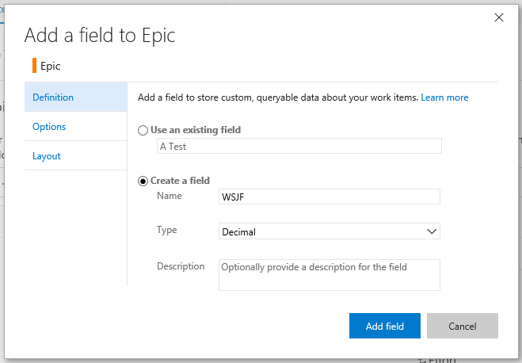
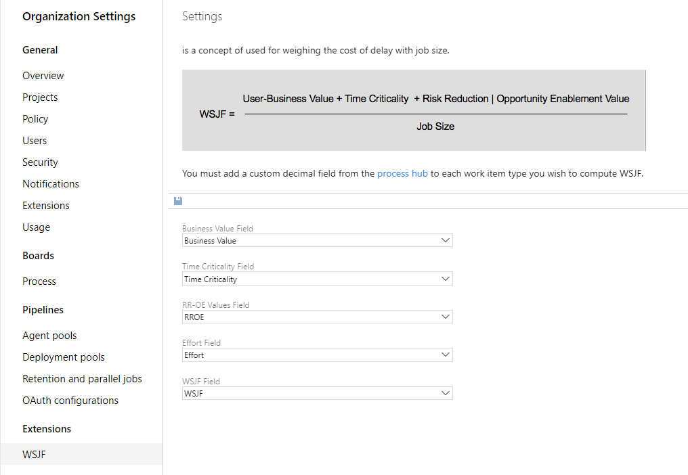
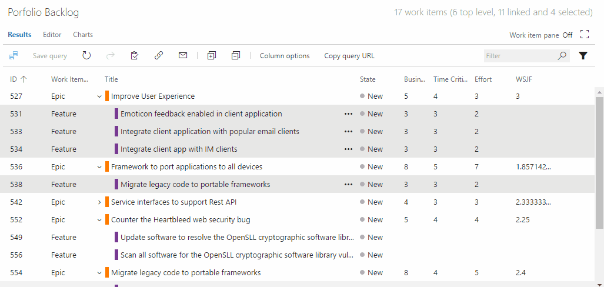
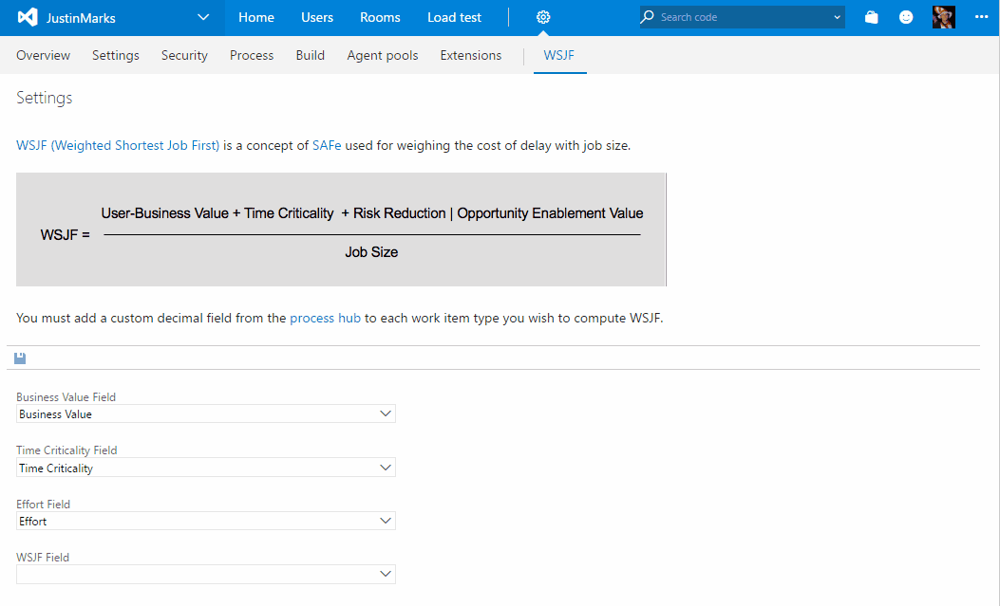

WSJF enables a **calculated field** for computing and storing WSJF on your work items.


The [Scaled Agile Framework](http://www.scaledagileframework.com) defines [WSJF (Weighted Shortest Job First)](http://www.scaledagileframework.com/wsjf/) as a calculation of cost of delay vs. job size which can help teams prioritize their portfolio backlogs with the items contributing the highest ROI.


Four values are used to calculate WSJF:
* **Business Value**
* **Risk Reduction | Opportunity Enablement Value**
* **Time Criticality** 
* **Job Size**

# Setup
1. The first thing you need is to create the fields that will store the RR-OE and WSJF values.  [Create a custom decimal field](https://www.visualstudio.com/en-us/docs/work/process/customize-process-field#add-a-custom-field) through the process hub and add it to the work items you want to display WSJF data on.


*NOTE: If you're using TFS onprem, you need to use witadmin to [Create a custom decimal field](https://www.visualstudio.com/en-us/docs/work/customize/add-modify-field#to-add-a-custom-field)*

2. Navigate to the "WSJF" hub on the collection settings admin experience.  From here, you must specify the fields that will be used for Business Value, Risk Reduction | Opportunity Enablement Value, Time Criticality, Job Size and WSJF.  The first three are defaulted to the fields provided out of the box by Microsoft but can be changed to custom fields if you prefer.


# Features
## Auto calculated WSJF field on the form
* WSJF is automatically updated when form is loaded.
* WSJF is automatically updated when the Business Value, Risk Reduction | Opportunity Enablement Value, Time Criticality, or Effort fields are updated.


## Recalculate WSJF context menu item
* Update WSJF for all selected work items on the backlog or query grid.


## Settings hub
* Specify which fields are used for WSJF, Business Value, Risk Reduction | Opportunity Enablement Value, Time Criticality, and Effort .


## Support
Because this extension requires the new work item form, it is only supported on Azure DevOps and the next version of TFS 2018 and above.
 
 ### Adding RROE and WSJF Score Values (For TFS) ###
 
 1. Export your WorkItem.XML file *(ie. Epic.XML)* using [WITAdmin](https://docs.microsoft.com/en-us/Azure DevOps/work/customize/reference/witadmin/witadmin-import-export-manage-wits?view=tfs-2018)
 2. At the bottom of your "Fields" section add the following (Name and reference names may vary):
 
``` xml
  <FIELD name="WSJF Risk-Reduction Opportunity-Enablement" refname="WSJF.RROEValue" type="Integer" reportable="dimension">
   <HELPTEXT>WSJF Risk-Reduction</HELPTEXT>
 </FIELD>
 
 <FIELD name="WSJF Score" refname="WSJF.Score" type="Double" reportable="dimension">
   <HELPTEXT>WSJF Score</HELPTEXT>
 </FIELD> 
```
3. Under your 
`<Form>` and `<WebLayout>` tags, choose where you would like the WSJF calculation to go and add:

```xml
<Section>
		   <Group Label="WSJF">
              <Control Label="User-Business Value" Type="FieldControl" FieldName="Microsoft.Azure DevOps.Common.BusinessValue" EmptyText="[Numbered Value]" />
              <Control Label="Urgency/Time Criticality" Type="FieldControl" FieldName="Microsoft.Azure DevOps.Common.TimeCriticality" EmptyText="[Numbered Value]" />
              <Control Label="Risk Reduction/Opportunity Enablement" Type="FieldControl" FieldName="WSJF.RROEValue" EmptyText="[Numbered Value]" />
			           <Control Label="Size" Type="FieldControl" FieldName="Microsoft.Azure DevOps.Scheduling.Effort" EmptyText="[Numbered Value]" />
              <Control Label="WSJF Score" Type="FieldControl" FieldName="WSJF.Score" EmptyText="[Numbered Value]" />
     </Group>
</Section>
```
4. After this is done, open up your WSJF tab and adjust your settings:

